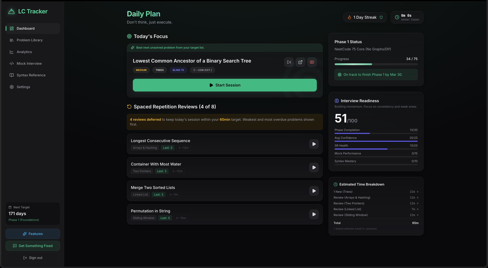

# LC-Tracker 

View Live: [https://lc-tracker.app/](https://lc-tracker.app/)

## Why I Built This

I am a student who knows I need consistent LeetCode practice to get interview-ready.

I liked the NeetCode approach, but I still needed a better way to answer two questions every week:

- Which problems should I do next?
- Which problems should I repeat, and when, using spaced repetition?

I was originally planning to manage this with a spreadsheet, but I realized I wanted something more structured and faster to use every day, so I started building LC-Tracker.

The first version was a local tool using browser cache for my own prep. Once a friend asked to use it too, I decided to turn it into a full web app with real user accounts and cross-device sync.

## Key Features

- **Spaced repetition for LeetCode problems**: Every problem can be reviewed on a schedule based on your past performance, so you spend more time where retention is weakest.
  
- **Structured sprint-based preparation**: Study in focused sprints with clear progress, pacing, and historical sprint context instead of random daily problem picking.
  
- **Problem library and filtering**: Browse and search problems by topic and difficulty, then quickly see what is solved, active, or needs review.
  
- **Progress analytics and mastery trends**: Visual analytics highlight completion patterns and weaker categories so your next study block is data-driven.
  
- **Session timing and review history**: Track how long sessions take and how your confidence changes over time for each problem.
  
- **Onboarding and study setup**: New users can define goals and preferences quickly, then start with an actionable plan.
  
- **Cross-device accounts and sync**: Sign in once and continue your prep from different devices without losing history.
  
- **In-app feedback submission**: Users can submit bugs or feature ideas directly from the app, including screenshots when needed.

## Tech Stack And Technologies Used

- **Frontend**: React 19, TypeScript, Vite
- **Styling and UI**: Tailwind CSS 4, Lucide icons, Motion (Framer Motion)
- **State and data fetching**: Zustand, TanStack React Query
- **Charts and visualization**: Recharts
- **Backend and database**: Supabase (PostgreSQL + row level security)
- **Authentication**: Clerk
- **Deployment**: Vercel

## Key Takeaways

- Building this moved me from ad hoc practice to a repeatable system.
- Spaced repetition is much easier to follow when scheduling is embedded into the workflow.
- Local-first prototypes are great for speed, but real usage quickly pushes you toward auth, sync, and better data design.
- Product feedback from real users changes priorities in a good way and helps focus on what actually improves daily prep.

## Feedback And Requests

There is a feedback button in the application where users can send feature requests, bug reports, and improvement ideas.

If something feels missing or broken, that button is the fastest path for getting it reviewed and added to the roadmap.

## Contributing

To keep support and requests in one place, please use the in-app feedback button for bug reports and feature requests.

When submitting feedback, include:

- What happened
- What you expected to happen
- Steps to reproduce
- A screenshot (if UI-related)

## Project Structure

- `src/components`: Core UI surfaces (dashboard, analytics, settings, and onboarding)
- `src/store`: Global client state with Zustand
- `src/hooks`: Realtime and user-data synchronization hooks
- `src/lib`: Supabase client and query client setup
- `src/services`: External service integrations
- `src/data`: Problem datasets and syntax card content
- `supabase/migrations`: Database schema and migration history

## License

This project is licensed under the MIT License. See the `LICENSE` file for details.
