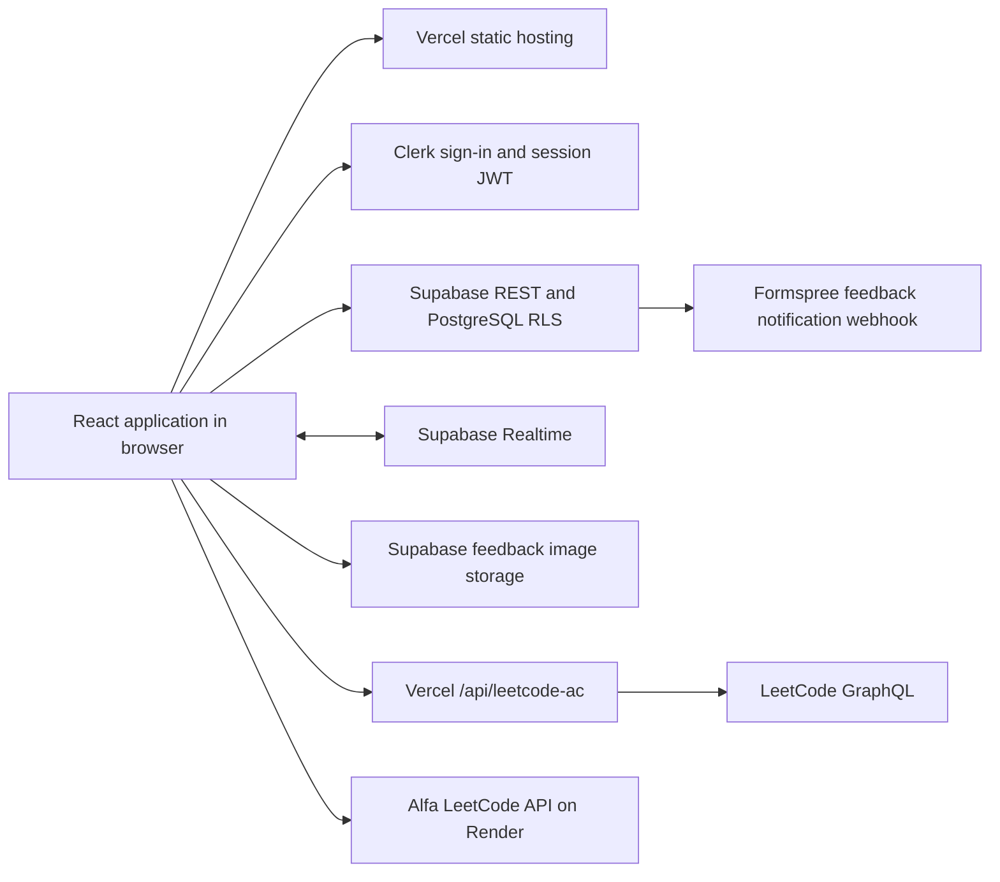

# Architecture and reliability review

Reviewed 2026-10-06 against the repository. This is an internal engineering record.
See [operations](operations.md) for release, recovery, and verification instructions.

## Service map

| Layer | Role | Code |
| --- | --- | --- |
| Vercel | Vite build, app route rewrites, read-only LeetCode proxy and readiness API | `vercel.json`, `api/` |
| React Router | Public catalog, sign-in, protected dashboard, timer, settings, analytics | `src/App.tsx` |
| Clerk | Accounts and JWTs supplied to Supabase REST, Storage, and Realtime | `src/main.tsx`, `src/lib/supabase.ts` |
| Supabase PostgreSQL | Study records, write receipts, feedback, and admin permissions; RLS isolates accounts | `supabase/migrations/` |
| User-data service | Confirmed reads, deterministic pagination, revision checks, transactional RPCs, backups | `src/services/userData.ts` |
| TanStack Query | Per-user caches and refetch after writes; polling recovers missed Realtime events | `src/hooks/useUserData.ts`, `src/lib/queryClient.ts` |
| Supabase Realtime | Invalidates caches on changes and reconnect | `src/hooks/useRealtimeSync.ts` |
| Zustand | Timer, owner, stable operation ID, and pending completion in sessionStorage | `src/store/useStore.ts` |
| Scheduling helpers | Review intervals, daily plans, sprint progression, streaks | `src/utils/progressHelpers.ts`, `src/utils/dateUtils.ts` |
| LeetCode integration | Up to 50 recent accepted submissions; same-origin proxy with external fallback | `src/services/leetcode.ts`, `server/leetcodeAc.ts` |
| Versioned datasets | Catalog, premium metadata, patterns, and syntax cards | `src/data/`, `scripts/` |
| Monitoring | Read-only provider readiness, hourly GitHub checks, optional sanitized Sentry events | `api/health.ts`, `.github/workflows/`, `src/lib/telemetry.ts` |

There is no scheduled reminder delivery service or running AI tutor in the
inspected application. Recommendations are computed when the app is used. The
Alfa API is external; the repository does not establish ownership of its Render
service. Clerk IDs are text; a historical migration replaces Supabase auth UUIDs
and updates RLS. Browser admin flags control the UI, not database authorization.
Production also has a feedback insert trigger calling Formspree through
`supabase_functions.http_request`; this provider-managed trigger was discovered
in the database export. It is disabled in the isolated restore check.

## Reliability repairs

The old problem logger computed an optimistic update, then computed a second
update from that cache while saving. It could count one rating twice. Timer saves
also split timings, progress, activity, and sprint changes across separate requests.
A failure after one request committed could create duplicates on retry.

The client now reads confirmed inputs, computes one update, and calls
`commit_user_change`. The database checks revisions and commits related rows and a
write receipt in one transaction. A retry uses the persisted operation UUID and
exact completion; the receipt prevents duplicate work even if the success response
was lost. Account-level advisory locks serialize these operations, and atomic SQL
increments preserve daily activity. Only confirmed revision conflicts are retried
with fresh reads. The timer survives failed saves and restores its pending rating
screen after reload. Changing signed-in accounts clears incompatible timers.

Settings use fresh updaters and version checks. Schedule changes patch review dates
without replacing history. Automatic sprint initialization requires successful
reads; initialization is checked again against fresh server state. Sprint ratings
advance or extend within the same session transaction. Reads no longer heuristically
reinterpret legacy ratings or overwrite settings during a migration.

LeetCode imports use insert-only database behavior, preserving existing reviews.
Invalid response shapes and dates fail instead of silently reporting empty imports.
Source reads fail before writes begin. Request and token deadlines prevent indefinite
loading; Clerk token failures are errors instead of anonymous successful reads.

Progress, activity, and recent timings fetch all pages with deterministic ordering,
including when the server caps a page below the requested range. Older timing
cursors include both timestamp and ID. Full JSON export uses a consistent database
snapshot and includes all timings. Restore validates the entire file, ignores
ownership/revision metadata, and writes all included records atomically.

Missing app configuration renders a recoverable unavailable page. Preferences use
storage helpers tolerant of restricted browsers. Shared mutation errors are visible
and ignored UI promises are observed. Error reporting is optional and strips personal
payloads. Realtime reconnects refetch data, with a polling fallback. CI, dependency
updates, a readiness endpoint, uptime checks, and release instructions are included.

Unused Gemini, SQLite, Express, and Vercel build-tool dependencies were removed.
Compatible dependencies were patched, Clerk moved to its supported React package,
and Vitest was updated. The installed dependency audit reports no vulnerabilities.
The esbuild override is limited to tsx; changing Vite's esbuild version introduced
an incompatible transform and was corrected before verification.

## Verification scope and remaining operational work

Checks include unit tests, real PostgreSQL transaction/RLS tests, concurrent database
connections, local browser failure/reload/retry tests, TypeScript, a production build,
and dependency auditing. GitHub CI passed 100 unit tests and 11 local Chromium browser tests, plus TypeScript, the PostgreSQL suite, the production build, and a zero-vulnerability dependency audit.
The local browser suite simulates Clerk/Supabase; it does not prove real OAuth or
hosted JWT enforcement. Database tests exercise the actual persistence migrations
with a minimal auth/role bootstrap.

The production rating and reliability migrations were applied after a private
database export and an isolated restore of all nine application tables (290 rows),
auth, and storage metadata. Migration checksums preserved existing application
records. Hosted SQL transaction/RLS checks passed inside a rolled-back transaction.
Branch protection requires CI. All six public browser checks pass on the released
production site; Clerk's sign-in button renders and Supabase's custom OIDC
integration trusts the production Clerk issuer.
The old deployed LeetCode function also failed native ESM startup; its import is
fixed and a compiled-function regression test now catches this failure.

Real OAuth completion and authenticated browser saves remain outside these checks.
The restore check skips platform ownership/grants and disables webhook delivery;
database archives do not contain Storage image bytes. Supabase currently lists no
physical backups or PITR. Optional Sentry alert destinations and scheduled
off-device backups remain unconfigured. Readiness is provider reachability, not
proof of end-to-end sign-in or full Supabase platform recovery.

The build still reports large CodeMirror/catalog chunks and upstream Zod annotation
warnings. Public routes and retry flows pass, but loading performance can be improved
separately. Review scheduling still uses the existing fixed intervals and calendar
phases; tutoring and reminder effectiveness remain a separate product task.
